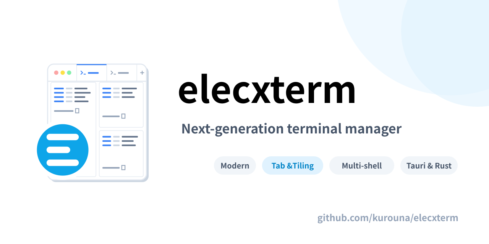

<p align="center">
  
</p>


[](https://opensource.org/licenses/MIT)
[](https://tauri.app/)

**elecxterm** は、Tauri v2 と Rust で構築された、モダンでスタイリッシュな次世代ターミナルマネージャーです。  
"elecxzy" エコシステムの一環として、直感的なタイリングレイアウト、高性能な PTY 管理、そして洗練されたユーザー体験を提供します。


## 🚀 主な機能

- **マルチタブ機能**: 複数の作業環境をタブで管理。各タブごとに独自のタイリングレイアウトを保持。
- **高度なタイリングエンジン**: 直感的な画面分割（垂直・水平）と、ドラッグアンドドロップによる直感的なサイズ調整。
- **マルチシェル対応**: `cmd.exe` や `PowerShell` を自在に使い分け、同一ウィンドウ内で一括管理。
- **高性能 PTY 管理**: `portable-pty` を採用した低レイテンシでクロスプラットフォームな疑似端末の実装。
- **洗練された UI/UX**:
    - **Midnight デザイン**: 深いネイビーを基調とした、目に優しくプレミアムな質感。
    - **Glassmorphism / Glow エフェクト**: 透明感のあるインターフェースと、アクティブペインの視覚的強調。
    - **キーボードファースト**: コマンドパレット (`Ctrl+Shift+K`) と豊富なショートカットによる高速な操作。
- **セッション永続化**: レイアウト設定を自動保存し、次回起動時にシームレスに復元。

## ⌨️ キーボードショートカット

| キー | アクション |
| :--- | :--- |
| `Ctrl+Shift+K` | コマンドパレットを開く |
| `Ctrl+Shift+D` | ペインを横に分割 (Horizontal) |
| `Ctrl+Shift+E` | ペインを縦に分割 (Vertical) |
| `Ctrl+Shift+T` | 新しいタブを作成 |
| `Ctrl+Shift+→` | 次のタブへ移動 |
| `Ctrl+Shift+←` | 前のタブへ移動 |
| `Ctrl+Shift+W` | アクティブなペインを閉じる |
| `Ctrl+Shift+N` | 次のペインへ移動 |
| `Ctrl+Shift+P` | 前のペインへ移動 |
| `Ctrl+Shift+<` | 先頭のペインへ移動 |
| `Ctrl+Shift+>` | 最後のペインへ移動 |

## 🛠️ 開発とビルド

### プリリクエスト

- **Rust**: [rustup](https://rustup.rs/) を通じて最新の安定版をインストールしてください。
- **Node.js**: LTS バージョンを推奨します。
- **Windows**: [Build Tools for Visual Studio 2022](https://visualstudio.microsoft.com/visual-cpp-build-tools/) が必要です。

### 初回セットアップ

リポジトリをクローンした後、初回のビルドを行う前に必ず以下のコマンドを実行して、OS 用のアイコン資産を生成してください。

```powershell
npm install
npx tauri icon ./app-icon.svg
```

### 開発用サーバーの起動 (Dev Build)

```powershell
.\dev.ps1
```

または単体での起動:
```powershell
npm run dev
```

### リリースビルド

実行バイナリとインストーラー（.msi / .exe）を生成します。

```powershell
npm run tauri build
```

### アイコンの更新

`app-icon.svg` を変更した場合は、以下のコマンドを実行することで、すべてのプラットフォーム用のアイコン（.ico, .icns, .png等）を再生成できます。

```powershell
npx tauri icon ./app-icon.svg
```

## 📂 プロジェクト構造

- `src/`: React フロントエンド (TypeScript, Tailwind CSS, Vite)
- `src-tauri/`: Rust バックエンド (Tauri v2, portable-pty)
- `src-tauri/icons/`: アプリアイコン資産

## 📄 ライセンス

このプロジェクトは **MIT License** の下で公開されています。詳細については [LICENSE](./LICENSE) を参照してください。

---

© 2026 elecxzy project
