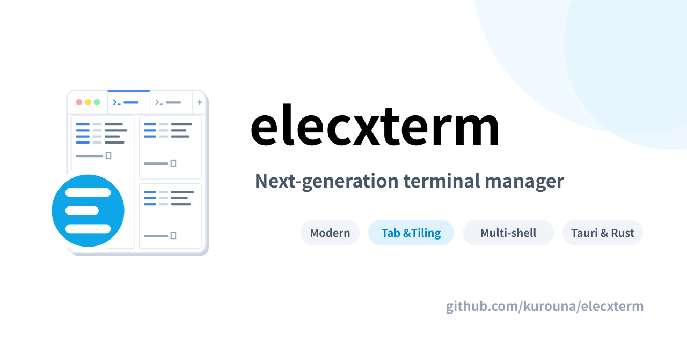
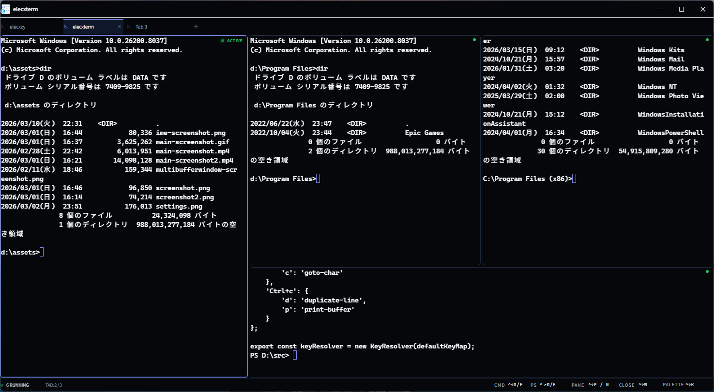
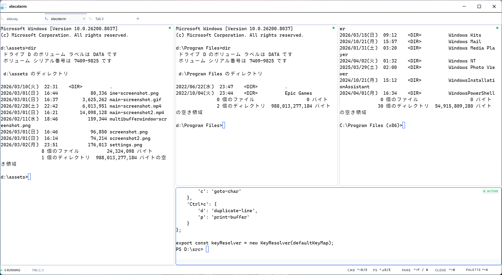
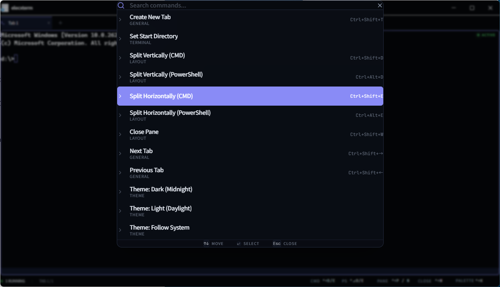

<p align="center">
  
</p>


[](https://opensource.org/licenses/MIT)
[](https://tauri.app/)
[](https://x.com/elecxzy)
[](https://github.com/google-deepmind/antigravity)

**elecxterm** は、Google Antigravity によって作成された、Tauri v2 と Rust で構築された次世代ターミナルマネージャーです。  
"elecxzy" エコシステムの一環として、直感的なタイリングレイアウト、高性能な PTY 管理、そして洗練されたユーザー体験を提供します。

　




> [!WARNING]
> **🚧 Project Status: Pre-release (Alpha) / 開発中（アルファ版）**
>
> This software is currently in an **early alpha stage**. Features are under active development, and some functions may be incomplete or unstable. Use with caution.
>
> 本ソフトウェアは現在、**開発初期のプレリリース（アルファ）版**です。すべての機能が完全に動作する状態ではなく、挙動が不安定な場合があります。あらかじめご了承ください。

## 🚀 主な機能

- **ペイン・オーバービュー (`Ctrl+Shift+O`)**: 全タブの全ペインを 1 枚の画面にカードで並べ、ライブプレビューを見ながら選んで移動。タブ識別色・タブ内の位置を示すミニマップ・未読出力/ベル/終了コードを表示し、文字入力でディレクトリ・コマンド・**出力内容**まで横断検索。
- **クイックスイッチ (`Ctrl+Tab`)**: Alt+Tab と同じ操作感。Ctrl を押したまま Tab で最近使ったペイン順に巡回し、離すと確定。一瞬だけ押せば直前のペインへ戻る。
- **マルチタブ + タイリング**: タブごとに独自の分割レイアウト。ドラッグでサイズ調整、ダブルクリックで均等化、`Ctrl+Shift+Z` でペインを一時的に最大化、ペインを新しいタブへ切り出し。
- **シェル統合（カレントディレクトリ追跡）**: cmd / PowerShell のプロンプトに OSC 9;9 を自動で仕込み（Windows Terminal と同方式）、各ペインの現在のディレクトリを追跡。分割したペインは**今いるディレクトリ**で開き、次回起動時も各ペインが最後のディレクトリで復元される。
- **タブ/ペインの自動命名**: 実行中のコマンドやディレクトリ名がタブ・ペイン見出しに反映（手動で命名すれば固定）。
- **見逃さない通知**: 裏のペインの新しい出力・ベルをタブ・オーバービュー・ステータスバーに表示。
- **長時間コマンドの完了通知**: シェル統合（OSC 133）でコマンドの開始・終了・所要時間（PowerShell は終了コードも）を計測。見ていないペインで既定 10 秒以上かかったコマンドが終わると、アプリ内トースト（「Show」で移動）か、ウィンドウが裏にあれば OS 通知 + タスクバー点滅で知らせる。オーバービューには実行中/直前のコマンドを表示。
- **端末の配色プリセット**: GitHub / Catppuccin / Solarized（ライト・ダークに追従）、One Dark / Dracula / Tokyo Night / Nord / Gruvbox。
- **Windows 11 の Mica / Mica Alt**: タイトルバー・ステータスバー・ペイン間の余白に壁紙の色が透ける（端末本体は不透明のまま）。
- **ペイン内検索 (`Ctrl+Shift+S`)**: 大文字小文字・単語単位・正規表現に対応。
- **コピー & ペースト**: 選択して離すと自動コピー、`Ctrl+Shift+C` / 選択中の `Ctrl+C` でコピー、`Ctrl+V` / `Ctrl+Shift+V` / 右クリックで貼り付け（bracketed paste 対応）。
- **終了したシェルの再起動**: 終了コードを表示し、Enter かボタンで同じディレクトリから再起動。
- **うっかり終了の防止**: コマンド実行中のペイン・タブを閉じようとすると、実行中のコマンド名を示して確認する。
- **さりげないガイド**: 初回起動時に主要ショートカットを紹介するカード、フォントサイズ変更時の HUD 表示。
- **コマンドパレット (`Ctrl+Shift+K`)**: あいまい検索・最近使ったコマンド・タブ/ペインへのジャンプ。
- **洗練された UI**: タブをタイトルバーに統合して縦の領域を節約、タイトルバーのボタンでナイト/ライトを円形リビールのアニメーション付きで切り替え、タブの色分け（右クリック）、非アクティブペインの減光、スクロールバックを遡っている時の「最下部へ戻る」ボタン、ウィンドウ非アクティブ時のタイトルバー減光、ショートカット一覧 (`Ctrl+Shift+?`)。
- **設定パネル (`Ctrl+Shift+.`)**: テーマ（プレビュー付き）・フォント（インストール済みか判定してプリセット表示、ライブプレビュー）・サイズ・行間・端末の配色・カーソル形状/点滅・ペイン見出し・減光の強さ・ウィンドウ背景（Mica）・完了通知のしきい値・開始ディレクトリ。
- **堅牢な PTY バックエンド**: 生バイトの Channel IPC、専用スレッドによる読み取り、ポーリング不要の終了監視、pwsh 未導入時の Windows PowerShell への自動フォールバック。
- **セッション永続化**: レイアウト・各ペインのディレクトリ・設定を自動保存し、ウィンドウを閉じる直前にも確実に書き出す。

## ⚠️ 制限事項

- **最大ペイン数**: システムリソースの最適化とパフォーマンス維持のため、アプリケーション全体で同時に開けるペイン（ターミナル）の数は最大 **15個** に制限されています。

## ⌨️ キーボードショートカット

既存のキーは「最後のペインへ移動」を除き従来どおりです（★ は新規・変更）。アプリ内では `Ctrl+Shift+?` で一覧を表示できます。

| キー | アクション |
| :--- | :--- |
| `Ctrl+Shift+K` | コマンドパレットを開く |
| ★ `Ctrl+Shift+O` | ペイン・オーバービュー（全タブのペイン一覧） |
| ★ `Ctrl+Tab` / `Ctrl+Shift+Tab` | 最近使ったペインへクイックスイッチ |
| ★ `Ctrl+Shift+?` | キーボードショートカット一覧 |
| ★ `Ctrl+Shift+S` | ペイン内検索 |
| ★ `Ctrl+Shift+.` | 設定パネル |
| `Ctrl+Shift+T` | 新しいタブを作成 |
| `Ctrl+Shift+→ / F` | 次のタブへ移動 |
| `Ctrl+Shift+← / B` | 前のタブへ移動 |
| ★ `Ctrl+Alt+1`〜`9` | n 番目のタブへ移動 |
| `Ctrl+Shift+D` | 右に分割 (CMD) |
| `Ctrl+Shift+E` | 下に分割 (CMD) |
| `Ctrl+Alt+D` | 右に分割 (PowerShell) |
| `Ctrl+Alt+E` | 下に分割 (PowerShell) |
| `Ctrl+Shift+W` | アクティブなペインを閉じる |
| ★ `Ctrl+Shift+Z` | ペインの最大化（ズーム）切り替え |
| `Ctrl+Shift+N / ↓` | 次のペインへ移動 |
| `Ctrl+Shift+P / ↑` | 前のペインへ移動 |
| `Ctrl+Shift+<` / ★ `Ctrl+Shift+Home` | 先頭のペインへ移動 |
| ★ `Ctrl+Shift+End` | 最後のペインへ移動（旧 `Ctrl+Shift+>` は設定パネルに変更） |
| ★ `Ctrl+Shift+C` / 選択中の `Ctrl+C` | コピー |
| ★ `Ctrl+V` / `Ctrl+Shift+V` | 貼り付け |
| `Ctrl+Shift+^` (US配列: `Ctrl+Shift+=`) | フォントサイズを拡大 |
| `Ctrl+Shift+-` | フォントサイズを縮小 |
| `Ctrl+0` または `Ctrl+Shift+¥` | フォントサイズをリセット |

オーバービュー内: 矢印キーで移動 / Enter で開く / `1`〜`9` で直接ジャンプ / `Ctrl+Shift+W` か Delete でペインを閉じる / 文字入力で絞り込み。

シェル統合を無効にしたい場合は、環境変数 `ELECXTERM_NO_SHELL_INTEGRATION=1` を設定して起動してください。

## 🛠️ 開発とビルド

### プリリクエスト

- **Rust**: [rustup](https://rustup.rs/) を通じて最新の安定版をインストールしてください（`winget install Rustlang.Rustup`）。
- **Node.js**: LTS バージョンを推奨します。
- **Windows**: [Build Tools for Visual Studio 2022](https://visualstudio.microsoft.com/visual-cpp-build-tools/)（C++ ワークロード + Windows SDK）が必要です。
  `winget install Microsoft.VisualStudio.2022.BuildTools --override "--quiet --wait --add Microsoft.VisualStudio.Workload.VCTools --includeRecommended"`

### 初回セットアップ

リポジトリをクローンした後、初回のビルドを行う前に必ず以下のコマンドを実行して、OS 用のアイコン資産を生成してください。

```powershell
npm install
npx tauri icon ./app-icon.svg
```

### 開発用サーバーの起動 (Dev Build)

```powershell
.\dev.ps1
```

または UI だけをブラウザで確認する場合（Tauri の IPC は疑似シェルでモックされます）:
```powershell
npm run dev   # http://localhost:1420 を開く
```

### リリースビルド

実行バイナリとインストーラー（.msi / .exe）を生成します。

```powershell
npm run tauri build
```

### アイコンの更新

`app-icon.svg` を変更した場合は、以下のコマンドを実行することで、すべてのプラットフォーム用のアイコン（.ico, .icns, .png等）を再生成できます。

```powershell
npx tauri icon ./app-icon.svg
```

## 🆙 バージョン更新

バージョン番号を変更する際は、以下のファイルを修正し、ロックファイルを更新してください。

### 修正が必要なファイル
- `package.json`
- `src-tauri/tauri.conf.json`
- `src-tauri/Cargo.toml`

### ロックファイルの更新コマンド
```powershell
npm install --package-lock-only
cargo update -p elecxterm --manifest-path src-tauri/Cargo.toml
```

### コミットメッセージの例
```text
chore: bump version to 0.0.x / バージョンを 0.0.x に更新

Updated version to 0.0.x in package.json, tauri.conf.json, and Cargo.toml. / package.json, tauri.conf.json, および Cargo.toml のバージョンを 0.0.x に更新しました。
```

## 📦 依存関係の更新

elecxterm は **フロントエンド (npm)** と **Rust バックエンド (Cargo)** の 2 系統の依存関係を持ちます。npm 系コマンドでは Rust 側は更新されないため、**両方** を更新する必要があります。

### 1. フロントエンド (npm)

```powershell
# semver 範囲内 (^/~) で安全に更新（メジャーは上がらない）
npm update

# メジャーを含めて最新まで上げる場合（package.json を書き換えるので install が必須）
npx ncu -u
npm install
```

`npm update` はロックファイルのみ更新します。`npx ncu -u` は `package.json` を最新版に書き換えるだけなので、続けて `npm install` を実行して反映してください。

### 2. Rust バックエンド (Cargo)

```powershell
# semver 範囲内で安全に更新（Cargo.lock のみ）
cargo update --manifest-path src-tauri/Cargo.toml

# メジャーを含めて最新まで上げる場合（cargo-edit が必要）
cargo install cargo-edit          # 初回のみ
cargo upgrade --manifest-path src-tauri/Cargo.toml
```

### 3. 更新後の検証（必須）

特にメジャー更新では **Tauri v2 / React 19** 周りで破壊的変更が入ることがあります。更新後は必ずビルドと実機起動を確認してください。

```powershell
npm run build        # TypeScript 型チェック + Vite ビルド
npm run tauri dev    # 実アプリで起動確認
```

### 4. コミットメッセージの例

更新の種類に応じて、以下を参考にしてください。`build(deps)` タイプを使用します。

- **依存関係を一括で最新化した場合（npm-check-updates -u / ncu -u）のコミットメッセージ例:**
  (※ `npm install -g npm-check-updates` でインストールするか、`npx ncu -u` で都度実行します)

```text
build(deps): update dependencies to latest via ncu / ncu による依存関係の一括最新化
```

- **semver 範囲内で安全に更新した場合（npm update）のコミットメッセージ例:**

```text
build(deps): update package-lock.json via npm update / npm update による package-lock.json の更新
```

- **Rust 依存を更新した場合（cargo update / cargo upgrade）のコミットメッセージ例:**

```text
build(deps): update Rust dependencies via cargo update / cargo update による Rust 依存関係の更新
```

- **npm と Rust をまとめて更新した場合のコミットメッセージ例:**

```text
build(deps): update npm and Rust dependencies to latest / npm および Rust の依存関係を一括で最新化

Updated frontend packages via ncu -u and npm install. / ncu -u と npm install でフロントエンドのパッケージを更新しました。
Updated src-tauri dependencies via cargo upgrade. / cargo upgrade で src-tauri の依存関係を更新しました。
```

## 📂 プロジェクト構造

- `src/`: React フロントエンド (TypeScript, Tailwind CSS, Vite)
- `src-tauri/`: Rust バックエンド (Tauri v2, portable-pty)
- `src-tauri/icons/`: アプリアイコン資産

## 📄 ライセンス

このプロジェクトは **MIT License** の下で公開されています。詳細については [LICENSE](./LICENSE) を参照してください。

---

© 2026 elecxzy project
