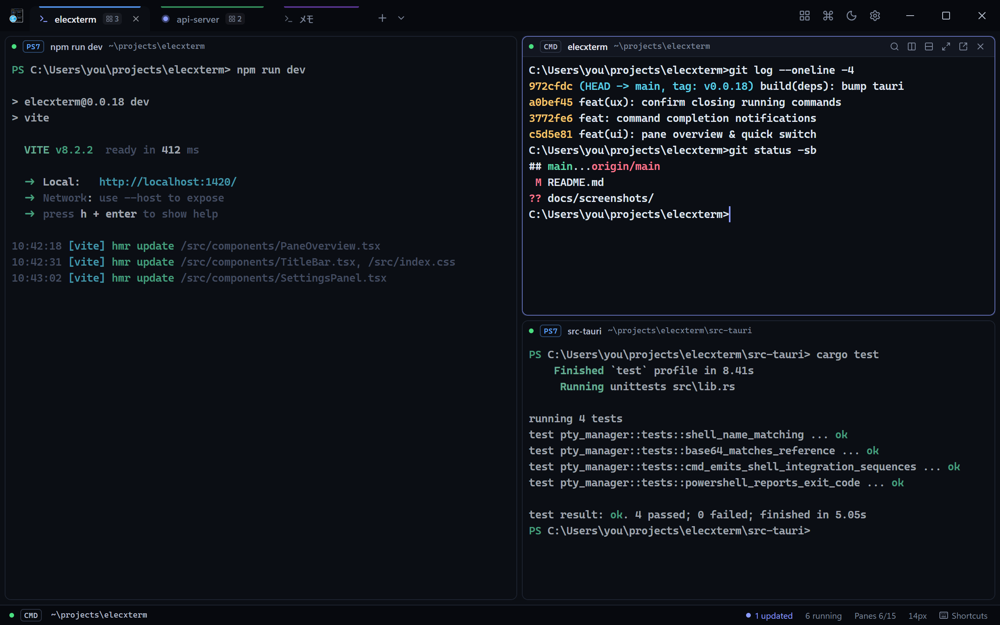
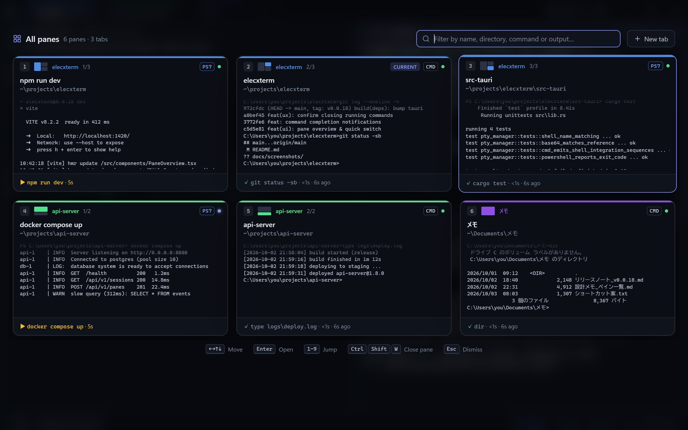
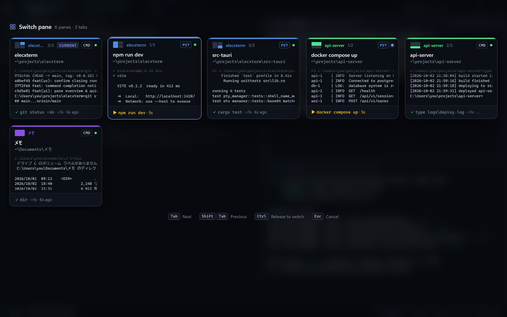
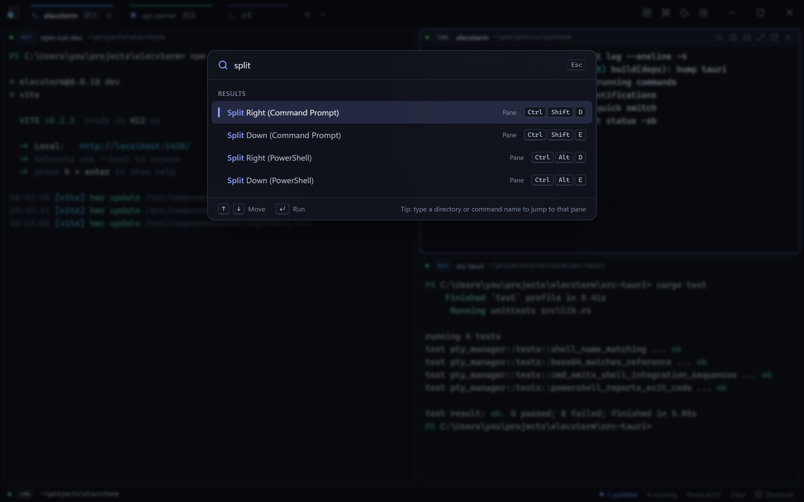
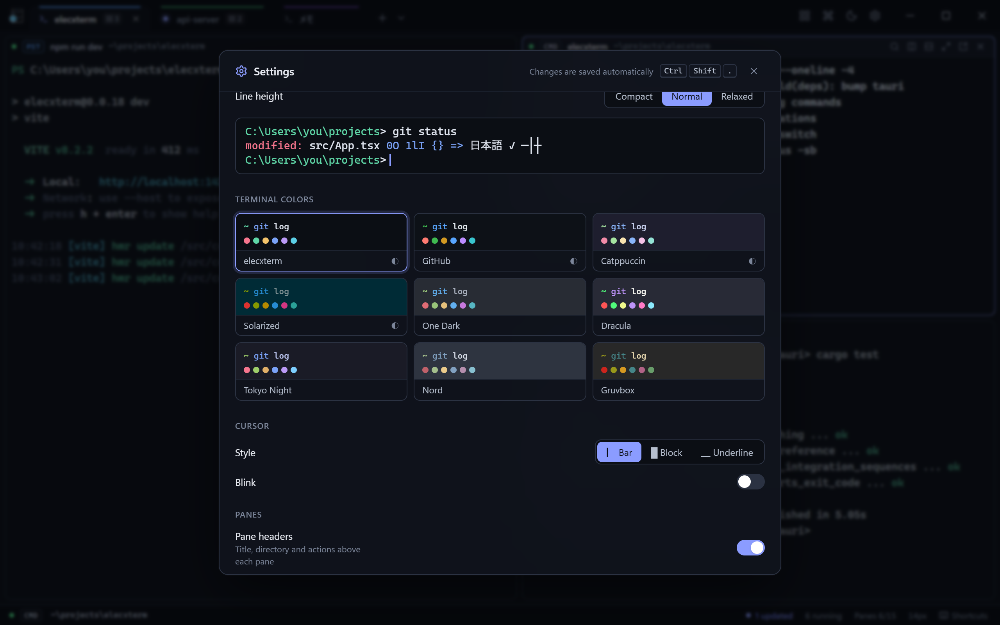
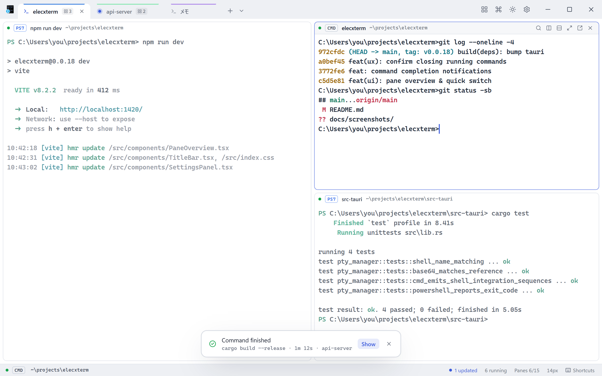

<p align="center">
  
</p>

<p align="center">
  <a href="https://github.com/kurouna/elecxterm/releases/latest"></a>
  <a href="https://opensource.org/licenses/MIT"></a>
  <a href="https://tauri.app/"></a>
  
  <a href="https://x.com/elecxzy"></a>
  <a href="https://github.com/google-deepmind/antigravity"></a>
</p>

**elecxterm** は、Tauri v2 と Rust で構築された Windows 向けの次世代ターミナルマネージャーです。
タブ × 分割ペインで作業を広げても迷わないよう、**全ペインを一望して選べるオーバービュー**、**Alt+Tab 感覚のペイン切り替え**、**シェル統合によるディレクトリ追跡とコマンド完了通知**を備えています。"elecxzy" エコシステムの一部として開発しています。

<p align="center">
  
</p>

> [!WARNING]
> **🚧 Pre-release (Alpha) / 開発中（アルファ版）**
>
> 本ソフトウェアは開発初期のプレリリース版です。すべての機能が完全に動作する状態ではなく、挙動が不安定な場合があります。
> This software is in an early alpha stage. Features are under active development and may be incomplete or unstable.

## 目次

- [ハイライト](#-ハイライト)
- [機能一覧](#-機能一覧)
- [インストール](#-インストール)
- [キーボードショートカット](#️-キーボードショートカット)
- [シェル統合](#-シェル統合)
- [設定](#️-設定)
- [開発](#️-開発)
- [リリース手順](#-リリース手順)
- [プロジェクト構成](#-プロジェクト構成)

## ✨ ハイライト

### ペイン・オーバービュー — 全タブのペインを 1 枚に

`Ctrl+Shift+O` で、すべてのタブのすべてのペインをカードで一覧します。各カードには**出力のライブプレビュー**、タブの色、タブ内での位置を示すミニマップ、**実行中・直前のコマンドと所要時間**が表示されます。文字を打てばディレクトリ名・コマンド・**出力の内容**で絞り込めます。



### クイックスイッチ — Alt+Tab と同じ感覚で

`Ctrl` を押したまま `Tab` を押すと、最近使った順にペインを巡回し、`Ctrl` を離した時点で切り替わります。一瞬だけ押せば直前のペインに戻ります。



### コマンドパレット — すべての操作を検索で

`Ctrl+Shift+K` で、あらゆる操作をあいまい検索して実行できます。最近使ったコマンドが上に並び、ペインやタブの名前・ディレクトリを打てばそこへジャンプできます。



### 設定パネル — 見た目も挙動もその場でプレビュー

`Ctrl+Shift+.` で開きます。テーマ、フォント（インストール済みかを判定）、配色プリセット、カーソル、ウィンドウ背景（Windows 11 の Mica）、完了通知のしきい値などを、プレビューを見ながら変更できます。変更は自動で保存されます。



### ライトテーマ

タイトルバーのボタンで、ナイトとライトを円が広がるアニメーションで切り替えられます。OS の設定に追従させることもできます。



## 📋 機能一覧

**タブとペイン**
- タブごとに独立した分割レイアウト（左右・上下を自由に入れ子）。境界のドラッグでサイズ調整、ダブルクリックで均等化。
- ペインのズーム（`Ctrl+Shift+Z`）、ペインを新しいタブへ切り出し。
- タブはタイトルバーに統合。ドラッグで並べ替え、ダブルクリックで名前変更、中クリックで閉じる、右クリックで色分け。
- 名前を付けていないタブ・ペインには、実行中のコマンドやディレクトリ名が自動で表示されます。
- 操作していないペインを少し暗くして、フォーカス位置を分かりやすくします（強さは設定で変更可能）。

**シェルとターミナル**
- cmd と PowerShell 7 を同じウィンドウで使い分け（PowerShell 7 が無ければ Windows PowerShell で起動）。
- シェル統合で現在のディレクトリを追跡。分割したペインは今いるディレクトリで開き、再起動後も各ペインが最後のディレクトリで復元されます。
- 時間のかかったコマンドが見ていないペインで終わると通知（アプリ内トースト、ウィンドウが裏にあれば Windows の通知とタスクバー点滅）。
- ペイン内検索（大文字小文字・単語単位・正規表現）。
- 選択してマウスを離すと自動コピー。`Ctrl+V` / `Ctrl+Shift+V` / 右クリックで貼り付け（cmd でも可）。
- 終了したシェルは終了コードを表示し、Enter かボタンで同じディレクトリから再起動。
- 実行中のコマンドがあるペインやタブを閉じるときは確認。
- スクロールして過去の出力を見ているときは「最下部へ戻る」ボタンを表示。

**見た目**
- Midnight（ダーク）/ Daylight（ライト）/ OS に追従。
- 端末の配色プリセット: GitHub・Catppuccin・Solarized（UI のライト/ダークに追従）、One Dark・Dracula・Tokyo Night・Nord・Gruvbox。
- Windows 11 の Mica / Mica Alt 背景（タイトルバーや余白に壁紙の色が透け、端末本体は不透明のまま）。
- WebGL 描画と、にじみを抑えた文字描画。日本語の表示にも対応。

**その他**
- レイアウト・ディレクトリ・設定を自動保存し、次回起動時に復元（ウィンドウを閉じる直前にも確実に保存）。
- 初回起動時に主要なショートカットを紹介。フォントサイズ変更時はサイズを画面中央に表示。

## 📦 インストール

[Releases](https://github.com/kurouna/elecxterm/releases) から最新版をダウンロードしてください。

| ファイル | 内容 |
| :--- | :--- |
| `elecxterm_<version>_x64_en-US.msi` | Windows インストーラー（推奨） |
| `elecxterm_<version>_x64-setup.exe` | NSIS インストーラー |
| `elecxterm.exe` | 実行ファイル（インストール不要） |

> [!NOTE]
> Windows SmartScreen の警告が出た場合は「詳細情報」→「実行」で進んでください。コードサイニング証明書が未設定のアルファ版のためです。

**動作環境**: Windows 10 / 11（Mica 背景は Windows 11 のみ）。PowerShell 7 の利用を推奨します（`winget install Microsoft.PowerShell`）。

## ⌨️ キーボードショートカット

アプリ内では `Ctrl+Shift+?` でいつでも一覧を表示できます。

**表示・移動**

| キー | 操作 |
| :--- | :--- |
| `Ctrl+Shift+O` | ペイン・オーバービュー（全タブのペイン一覧） |
| `Ctrl+Tab` / `Ctrl+Shift+Tab` | 最近使ったペインへクイックスイッチ |
| `Ctrl+Shift+K` | コマンドパレット |
| `Ctrl+Shift+.` | 設定パネル |
| `Ctrl+Shift+?` | ショートカット一覧 |
| `Ctrl+Shift+S` | ペイン内検索 |

**タブ**

| キー | 操作 |
| :--- | :--- |
| `Ctrl+Shift+T` | 新しいタブ |
| `Ctrl+Shift+F` / `Ctrl+Shift+→` | 次のタブ |
| `Ctrl+Shift+B` / `Ctrl+Shift+←` | 前のタブ |
| `Ctrl+Alt+1`〜`9` | n 番目のタブ |

**ペイン**

| キー | 操作 |
| :--- | :--- |
| `Ctrl+Shift+D` / `Ctrl+Shift+E` | 右 / 下に分割（Command Prompt） |
| `Ctrl+Alt+D` / `Ctrl+Alt+E` | 右 / 下に分割（PowerShell） |
| `Ctrl+Shift+N` / `Ctrl+Shift+↓` | 次のペイン |
| `Ctrl+Shift+P` / `Ctrl+Shift+↑` | 前のペイン |
| `Ctrl+Shift+<` / `Ctrl+Shift+Home` | 先頭のペイン |
| `Ctrl+Shift+End` | 最後のペイン |
| `Ctrl+Shift+Z` | ペインのズーム切り替え |
| `Ctrl+Shift+W` | ペインを閉じる |

**ターミナル**

| キー | 操作 |
| :--- | :--- |
| `Ctrl+Shift+C` / 選択中の `Ctrl+C` | コピー |
| `Ctrl+V` / `Ctrl+Shift+V` / 右クリック | 貼り付け |
| `Ctrl+Shift+^`（US 配列: `Ctrl+Shift+=`） | フォントサイズを拡大 |
| `Ctrl+Shift+-` | フォントサイズを縮小 |
| `Ctrl+0` / `Ctrl+Shift+¥` | フォントサイズをリセット |
| `Enter`（終了したペインで） | シェルを再起動 |

**オーバービュー内**: 矢印キーで移動 / `Enter` で開く / `1`〜`9` で直接ジャンプ / `Ctrl+Shift+W` か `Delete` でペインを閉じる / 文字入力で絞り込み / `Esc` で閉じる。

> v0.0.18 で「最後のペインへ移動」は `Ctrl+Shift+>` から `Ctrl+Shift+End` に変わりました（`Ctrl+Shift+.` は設定パネル）。

## 🔗 シェル統合

elecxterm は cmd と PowerShell の起動時に、プロンプトへ目に見えない制御シーケンスを仕込みます。[Windows Terminal と同じ方式](https://learn.microsoft.com/windows/terminal/tutorials/new-tab-same-directory)で、ユーザーの設定ファイルは書き換えません。

| シーケンス | 用途 |
| :--- | :--- |
| `OSC 9;9` | 現在のディレクトリ（分割時の引き継ぎ、復元、見出し表示） |
| `OSC 133;A/B/D` | コマンドの開始・終了と所要時間（完了通知、オーバービューの表示）。PowerShell は終了コードも送ります |

- **cmd**: 環境変数 `PROMPT` の前後にシーケンスを追加します。すでに `PROMPT` で同様の設定をしている場合は何もしません。
- **PowerShell**: プロファイル（oh-my-posh や Starship を含む）を読み込んだ後に、既存の `prompt` 関数をラップします。
- 無効にしたい場合は、環境変数 `ELECXTERM_NO_SHELL_INTEGRATION=1` を設定してから起動してください。

## ⚙️ 設定

設定パネル（`Ctrl+Shift+.` またはタイトルバーの歯車）から変更でき、`%APPDATA%\elecxterm\elecxterm-settings.json` に自動保存されます。

| 項目 | 内容 |
| :--- | :--- |
| テーマ | Midnight / Daylight / OS に追従 |
| フォント | プリセット（インストール済みかを表示）または任意の `font-family`。サイズ・行間 |
| 端末の配色 | 9 種類のプリセット |
| カーソル | Bar / Block / Underline、点滅 |
| ペイン | 見出しの表示、非アクティブペインの減光（なし / 弱 / 強） |
| ウィンドウ | Solid / Mica / Mica Alt（Windows 11） |
| 通知 | 完了を通知するコマンドの所要時間（Off / 5 秒 / 10 秒 / 30 秒 / 1 分） |
| 起動 | 新しいタブの開始ディレクトリ |

**制限事項**: 同時に開けるペインはアプリ全体で最大 **15 個**です（描画に使う WebGL コンテキスト数の上限による）。

## 🛠️ 開発

### 必要なもの

- **Node.js** LTS
- **Rust**（stable / MSVC）: `winget install Rustlang.Rustup`
- **Visual Studio 2022 Build Tools**（C++ ワークロード + Windows SDK）:
  ```powershell
  winget install Microsoft.VisualStudio.2022.BuildTools --override "--quiet --wait --add Microsoft.VisualStudio.Workload.VCTools --includeRecommended"
  ```

### セットアップと起動

```powershell
npm install
npx tauri icon ./app-icon.svg   # 初回のみ: アプリアイコンを生成（src-tauri/icons は Git 管理外）
npm run tauri dev               # アプリとして起動
```

### ブラウザだけで UI を確認する

`npm run dev` で起動した http://localhost:1420 を普通のブラウザで開くと、Tauri の IPC がモックされ、簡易的な疑似シェル（`dir` / `cd` / `ping` / `sleep N` / `fail N` など）で UI を操作できます（開発ビルドのみ）。

URL に `?demo=<scene>&theme=<dark|light>` を付けると、README のスクリーンショットと同じ状態を再現できます（`main` / `overview` / `switch` / `palette` / `settings`）。スクリーンショットは `npm run dev` を起動した状態で次のスクリプトを実行すると撮り直せます。

```powershell
./scripts/capture-screenshots.ps1   # docs/screenshots/ に 2x 解像度で保存
```

### テストとビルド

```powershell
npm run build                                      # TypeScript の型チェック + Vite ビルド
cargo test --manifest-path src-tauri/Cargo.toml     # Rust のユニットテスト
cargo test --manifest-path src-tauri/Cargo.toml -- --ignored   # 実際の cmd / PowerShell でシェル統合を検証
npm run test:e2e                                   # e2e テスト（Playwright + インストール済みの Edge）
npm run tauri build                                # インストーラー（.msi / .exe）を生成
```

e2e テスト（`e2e/`）は開発サーバーを自動で起動し、ブラウザ上で IPC をモックした状態で、タブやペインを開く・分割する・`Ctrl+Shift+W` で閉じる・再読み込みで復元する、といった操作を実際のキー入力で検証します。閉じたペインやタブのシェルがすべて破棄されていること（プロセスのリークが無いこと）も毎回確認します。

## 🚀 リリース手順

1. `package.json` / `src-tauri/tauri.conf.json` / `src-tauri/Cargo.toml` のバージョンを更新し、ロックファイルを更新します。
   ```powershell
   npm install --package-lock-only
   cargo update -p elecxterm --manifest-path src-tauri/Cargo.toml
   ```
2. **タグを付ける前に `npm run tauri build` を通します。** npm の `@tauri-apps/*` と Rust の Tauri クレートのメジャー・マイナーバージョンがずれていると、`tauri build`（とリリース CI）が失敗します。`cargo test` ではこの不一致を検出できません。
3. `vX.Y.Z` タグを push すると、GitHub Actions がビルドしてリリースを作成します。

コミットメッセージは英語と日本語を ` / ` で併記します（例: `chore: bump version to 0.0.x / バージョンを 0.0.x に更新`）。

### 依存関係の更新

フロントエンド（npm）と Rust（Cargo）の両方を更新してください。Tauri 関連は両側のバージョンを揃えます。

```powershell
npx ncu -u; npm install                                  # npm（メジャー含む）
cargo update --manifest-path src-tauri/Cargo.toml         # Rust（semver 範囲内）
npm run tauri build                                      # 両側の整合性を確認
```

## 📂 プロジェクト構成

```text
src/                     React + TypeScript フロントエンド
  components/            タイトルバー・タブ・ペイン・オーバービュー・パレット・設定などの UI
  hooks/                 レイアウト状態（useLayout）、キーバインド、通知、ウィンドウ素材
  services/              端末と PTY の管理（terminalRegistry）、ペイン状態ストア、表示用ヘルパー
  dev/                   開発用の IPC モックとデモシナリオ（本番ビルドには含まれない）
  theme.ts / index.css   配色（CSS 変数）と端末の配色プリセット
  keymap.ts              ショートカットの表示定義
src-tauri/               Rust バックエンド（Tauri v2, portable-pty）
  src/pty_manager.rs     PTY の生成・入出力・終了監視とシェル統合
docs/                    改善プラン（UX_IMPROVEMENT_PLAN.md）とスクリーンショット
e2e/                     Playwright による e2e テスト
scripts/                 スクリーンショット撮影スクリプト
```

## 📄 ライセンス

[MIT License](./LICENSE)

---

© 2026 elecxzy project
